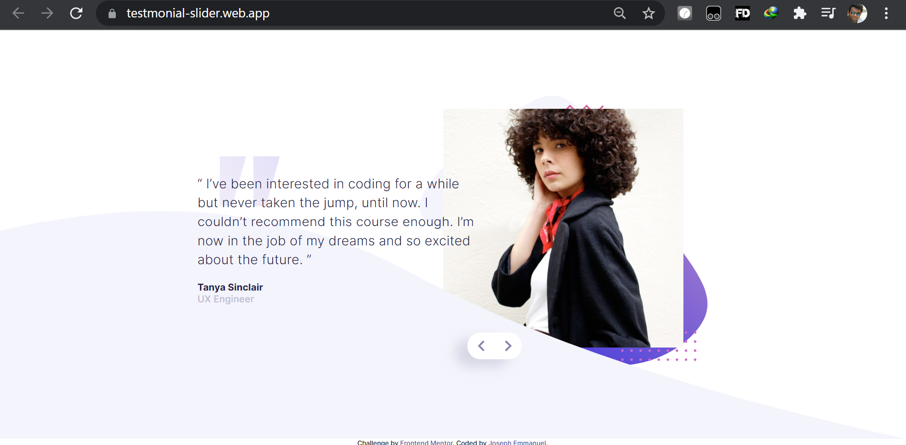

# Great Gulf Coding Challenge

## Table of contents

- [Overview](#overview)
  - [The challenge](#the-challenge)
  - [Screenshot](#screenshot)
  - [Links](#links)
- [My process](#my-process)
  - [Built with](#built-with)
  - [What I learned](#what-i-learned)
  - [Continued development](#continued-development)
  - [Useful resources](#useful-resources)
- [Author](#author)
- [Acknowledgments](#acknowledgments)

**Note: Delete this note and update the table of contents based on what sections you keep.**

## Overview

The given task was complted within a few hours of work. The woork was not that cmplicated as i used simple css and vanilla js to complete the challenge

### The challenge

Users should be able to:

- View the optimal layout for the component depending on their device's screen size
- Navigate the slider using either their mouse/trackpad or keyboard

### Screenshot

- Desktop Preview: 
- Mobile Preview: 

### Links

- Solution URL: (https://github.com/joseph-emmanuel/great_gulf_coding_challenge)
- Live Site URL: (https://testmonial-slider.web.app/)
- Live Site URL: (https://joseph-emmanuel.github.io/great_gulf_coding_challenge/)

## My process

First step was to create the HTML file with necessary tags and components. once the work flow setting up done. The project completed pretty easy

### Built with

- HTML 5
- CSS
- Flexbox
- Media quiries
- Mobile-first workflow

### What I learned

Use this section to recap over some of your major learnings while working through this project. Writing these out and providing code samples of areas you want to highlight is a great way to reinforce your own knowledge.

To see how you can add code snippets, see below:

```html
<h1>Some HTML code I'm proud of</h1>
```

```css
.card__image {
  width: 100%;
  margin: 0 auto;
  height: 100%;
  padding: 40px;
  background-image: url(./images/pattern-bg.svg);
  background-position: center;
  background-repeat: no-repeat;
  background-size: contain;
}
.card__image__img {
  height: 100%;
  width: 300px;
}
}
```

```js
function previousSlide() {
  currentPostion--;
  currentPostion = currentPostion < 0 ? CARDS.length - 1 : currentPostion;
  displayCard(currentPostion);
}
function displayCard(postion) {
  CARDS.forEach((card) => {
    card.style.display = "none";
  });
  CARDS[postion].style.display = "flex";
}
```

### Continued development

The project was deployed in github pages as well as firebase. i will be working on automated deployment in firebase and using github actions to the same.

## Author

- Website - [Add your name here](https://joseph-emmanuel.github.io/joseph-emmanuel/)
